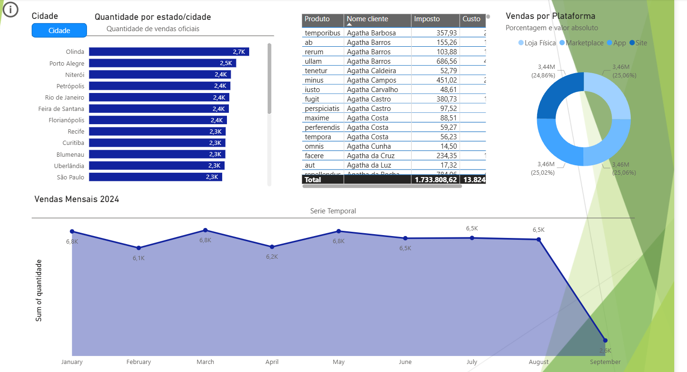
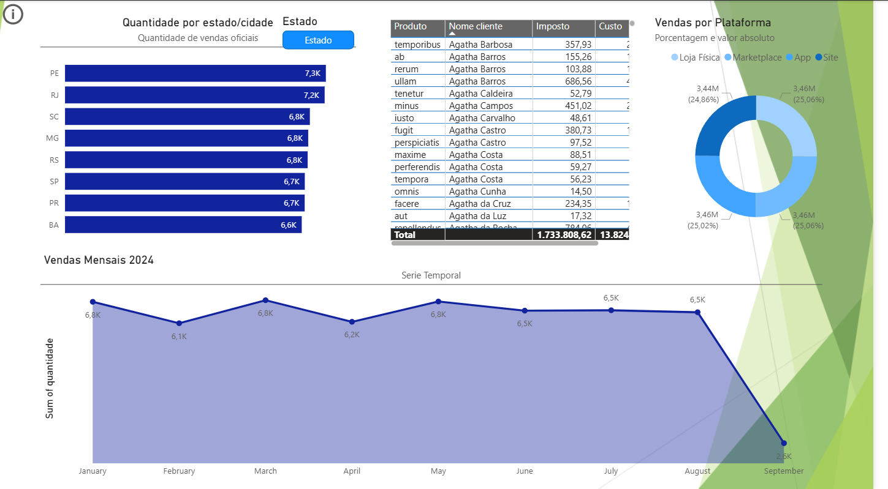

# 📊 Analise de Vendas - Tipos de Visualizações no Power BI

Exercício prático desenvolvido durante o módulo 03 do curso de Power BI, com foco na exploração dos principais tipos de visualizações disponíveis na ferramenta.

---

## 🎯 Objetivo

Praticar a criação e configuração dos diferentes tipos de visuais do Power BI, aplicando-os sobre uma base de dados de vendas.

---

## 📁 Páginas do Relatório

| Página | Conteúdo |
|---|---|
| 📊 Barras | Quantidade de vendas por categoria de produto |
| 📈 Linhas | Evolução de dados por estado |
| 🍕 Pizza | Distribuição por estado |
| 📉 Histograma e Dispersão | Análise de custo e distribuição por estado |
| 🔽 Filtros e Segmentações | Uso de slicers e filtros interativos |
| 🗂️ Tabela e Matrizes | Cruzamento de dados por categoria, cidade e estado |
| 🌡️ Velocímetro | Indicador de meta (KPI gauge) |
| 🌳 Árvore Hierárquica | Decomposição de produtos por estado |
| 🃏 Cartões | Total de quantidade vendida |
| 🗺️ Mapas | Distribuição geográfica por estado e cidade |
| 📦 Boxplot e Marketplace | Análise estatística de quantidade por estado |
| 🏆 Projeto Final | Dashboard completo de Vendas 2024 |

---

## 🏆 Projeto Final (Dashboard de Vendas)

A última página reúne os conhecimentos do módulo em um dashboard completo com:

- **Quantidade por Estado/Cidade** — Gráfico de barras com drill-down
- **Vendas por Plataforma** — Gráfico de rosca
- **Vendas Mensais 2024** — Gráfico de linha com evolução temporal
- **Filtros por Estado e Cidade** — Segmentações interativas

---

## 🛠️ Tecnologias Utilizadas

- **Power BI Desktop**
- **DAX** (Data Analysis Expressions)
- **Modelagem de dados relacional**

---

## 🚀 Como Utilizar

1. Faça o download do arquivo `Analise de vendas.pbix`
2. Abra o [Power BI Desktop](https://powerbi.microsoft.com/pt-br/desktop/) *(gratuito)*
3. Abra o arquivo pelo menu **Arquivo > Abrir**
4. Navegue pelas páginas para explorar cada tipo de visualização

---

## 📷 Preview

>  

---

## 👨‍💻 Autor

Desenvolvido por **Arthur Vieira**  
🔗 [GitHub](https://github.com/Arthur-Vieira19)
